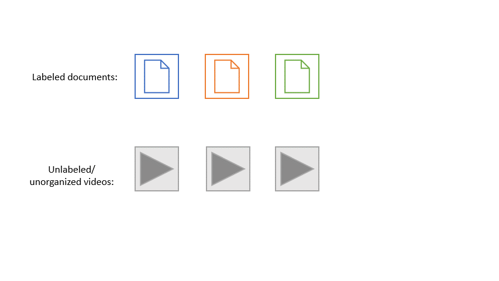
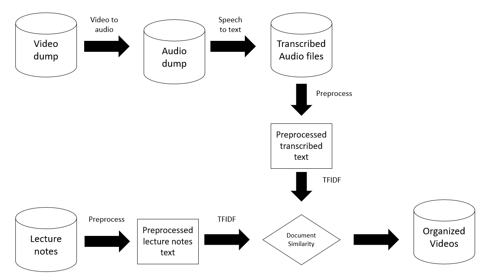

# auto_video_organizer
[Access the report](https://github.com/anasm-17/video_organizer/blob/master/report.html) 

For this project, I use [Mike Gelbart's](https://www.mikegelbart.com/) lecture videos and notes to demonstrate a POC on how one can organize unlabeled documentaries or lecture videos to similar text documents by performing speech recognition and text similarity. You can find the report of the solution [here](https://github.com/anasm-17/video_organizer/blob/master/report.html). Thank you [Mike](https://www.mikegelbart.com/) for allowing me to do this on your lecture materials and demonstrate it publicly.

## Problem
Our live lecture recording videos for the Master of Data Science program were dumped into a server with date and time as the video titles. I wanted to come up with an automated way of organizing the lecture videos on my laptop to match them with corresponding lecture notes. There could be a number of approaches better and faster than this but this idea came to mind and I was eager to test it out.

## Workflow

1) Convert the video files to audio
2) Perform speech recognition on audio files
3) Preprocess transcribed text
4) Preprocess lecture notes
5) Perform document similarity with 3. and 4.
6) Rename video files with appropriate names or move video files to respective directories
