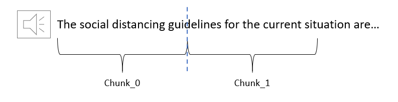
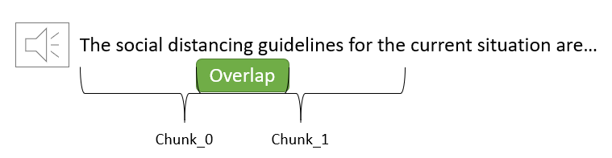

```python
from pydub import AudioSegment # https://github.com/jiaaro/pydub
import gc
import speech_recognition as sr
from pydub.silence import split_on_silence
import os
import librosa
import librosa.display
import matplotlib.pyplot as plt
import time
import pandas as pd
import numpy as np
from bs4 import BeautifulSoup
import glob
```

## Table of Contents
#### [1. Preprocessing video and audio](#1.0)

- [1.1. convert video to audio (wav) files](#1.1)
- [1.2. convert audio to text [1] [2]](#1.2)

#### [2. Performing text similarity matching](#2.0)

- [2.1 Read ipynb notebooks](#2.1)
- [2.2 Preprocess text](#2.2)
- [2.3 Performing text similarity](#2.3)

#### [3. Results](#3.0)
#### [References](#references)

## 1. Preprocessing video and audio <a class="anchor" id="1.0"></a>

### 1.1 convert video to audio (wav) files <a class="anchor" id=1.1></a>

>I'll be using `lecture 3 - floating points` and `lecture 5 - neural networks` from Mike Gelbart's [Supervised Learning II playlist](https://www.youtube.com/playlist?list=PLWmXHcz_53Q3KLISD8jydKjz41b9iqERC)

> Place video files in mp4 format to `data/video/`

#### 1.1.1 load video files


```python
vid_1 = AudioSegment.from_file("data/video/20200120-102822-008.mp4")
vid_2 = AudioSegment.from_file("data/video/20200127-102817-008.mp4")
```

> we will use this dictionary for the results section


```python
videos_dict = {f"vid_{i+1}" : os.listdir("data/video")[i] for i in range(len(os.listdir("data/video")))}
videos_dict
```


    {'vid_1': '20200120-102822-008.mp4', 'vid_2': '20200127-102817-008.mp4'}


> Providing the URLs for readers to view the videos as you do not have access to the video dump available for UBC Master of Data Science students.


```python
video_urls = {"20200120-102822-008.mp4": "https://youtu.be/kNxLxwIduko",
              "20200127-102817-008.mp4": "https://youtu.be/1wYHXT-Ee5U"}
video_urls
```


    {'20200120-102822-008.mp4': 'https://youtu.be/kNxLxwIduko',
     '20200127-102817-008.mp4': 'https://youtu.be/1wYHXT-Ee5U'}


#### 1.1.2 Convert video to audio

> Need to convert to wav format for speech recognition. I will not be performing any audio preprocessing as I'll be working on the baseline model, with minimal effort. If the results are not favorable I may preprocess the audio files.


```python
vid_1.export("data/audio/vid_1.wav", format="wav")
vid_2.export("data/audio/vid_2.wav", format="wav")
```


    <_io.BufferedRandom name='data/audio/vid_2.wav'>


```python
del vid_1, vid_2
gc.collect();
```

### 1.2 Convert audio to text [1] [2] <a class="anchor" id="1.2"></a>

#### 1.2.1 Chunk audio files

> Need to chunk audio files as I am using Google's free speech recognition API, which only processes 5 seconds worth of information at a time.


```python
def audio_chunker(audio_files_dir, op_dir, chunk_size=5000):
    """
    Takes in list of audio files
    directories and prepares 
    audio segment to process into
    audio chunks. Output of chunk
    will be under subdirectory of
    video title under op_dir/vid_n
    where n is count of video.
    
    Parameters:
    ----------
    audio_files_dir : list
        list of audio files to
        create chunks of.
    
    op_dir : str
        output directory to 
        store chunks.
    
    chunk_size : int
        size of audio chunks in ms,
        default 5000 as Google API
        supports 5 seconds.
    
    Returns:
    --------
    None
    
    Example:
    --------
    >>> audio_files = ["data/audio/vid_1.wav", "data/audio/vid_2.wav"]
    >>> audio_chunker(audio_files, "data/audio_chunks/")
    """
    audio_segs = [AudioSegment.from_wav(audio_files[0]),
                  AudioSegment.from_wav(audio_files[1])]
    
    for count, audio_seg in enumerate(audio_segs):
        
        print(f"Prcoessing audio file {count+1}/{len(audio_segs)}...")
        len_audio = len(audio_seg) # length of audio segment
        n_chunks = len_audio//chunk_size # calculate chink size
        
        storage_dir = f"{op_dir}vid_{count+1}/"
        os.mkdir(storage_dir) # create storage dir
        
        # create chunks and export to directory
        for i in range(n_chunks):
            
            if i == 0:
                start = 0
                end = chunk_size
            else:
                start = end
                end = start + chunk_size

            chunk = audio_seg[start:end]
            
            # write chunk to `storage_dir`
            chunk.export(f"{storage_dir}chunk_{i}.wav", format="wav")
    
    print("Processing complete!")
```


```python
audio_files = ["data/audio/vid_1.wav", "data/audio/vid_2.wav"]
audio_chunker(audio_files, "data/audio_chunks/")
```

    Prcoessing audio file 1/2...
    Prcoessing audio file 2/2...
    Processing complete!
    

#### 1.2.2 Speech recognition and saving to text file


```python
import speech_recognition as sr
```


```python
def audio_chunk_to_text(audio_chunks_dir, op_dir, max_text_len=10000):
    """
    Takes in audio chunks directory
    and performs speech recognition
    on each chunk and stores text
    to vid_n.txt where n is the 
    count of the video.
    
    Parameters:
    ------------
    audio_chunks_dir : str
        parent directory where audio 
        of where audio chunks for 
        video_n's are located.
    
    op_dir : str
        text storage directory,
        will be in the form video_n.txt,
        where n is the count of video.
        
    max_text_len : 
        will stop the speech recognition
        after if exceeds max_character length.
        
    Returns:
    ---------
    None
    """
    # set up speech recognizer class
    r = sr.Recognizer()
    
    # audio chunk files
    audio_chunk_videos = os.listdir(audio_chunks_dir)
    
    for count, video in enumerate(audio_chunk_videos):
        # load audio chunks
        audio_chunks = os.listdir(audio_chunks_dir + video)
        print(f"Processing video: {count+1}/{len(audio_chunk_videos)}")
        print("---"*12)
        output_text = ""
        step_counter = 0
        
        # perform speech recognition
        # on each chunk
        for i in range(len(audio_chunk_files)):
            if i%5 == 0:
                print(f"Step {step_counter+1}")
                print(f"Char length: {len(output_text)}")
                print(f"Processing chunk: {i+1}/{len(audio_chunks)}...")
                step_counter += 1
            
            # read chunk
            aud_file = f"{audio_chunks_dir}{video}/chunk_{i}.wav"
            
            with sr.AudioFile(aud_file) as source:
                # adjust for ambient noise
                r.adjust_for_ambient_noise(source)
                
                # get the text from audio from chunk
                audio = r.listen(source)
            
            # try to perform speech recognition
            try:
                # if succeeds, append text to
                # output text
                text = r.recognize_google(audio)
                output_text += text + " "

            except Exception as e:
                # if fails, pass to the
                # next loop/chunk
                pass
            
            # early stopping, as I do not
            # wish to process the entire
            # set of chunks. If output text
            # length reached, break.
            if len(output_text) > max_text_len:
                break

            time.sleep(0.5) # to be nice to google's free API
        
        # write output to text file
        text_file = open(f"{op_dir}transcribed_{video}.txt", "w+")
        text_file.write(output_text)
        text_file.close()
        print(f"Process complete! {i+1}/{len(audio_chunks)} converted.")
```


```python
audio_chunk_to_text("data/audio_chunks/", "data/text/")
```

    Processing video: 1/2
    ------------------------------------
    Step 1
    Char length: 0
    Processing chunk: 1/1018...
    Step 2
    Char length: 195
    Processing chunk: 6/1018...
    Step 3
    Char length: 351
    Processing chunk: 11/1018...
    Step 4
    Char length: 486
    Processing chunk: 16/1018...
    Step 5
    Char length: 641
    Processing chunk: 21/1018...
    Step 6
    Char length: 753
    Processing chunk: 26/1018...
    Step 7
    Char length: 887
    Processing chunk: 31/1018...
    Step 8
    Char length: 1052
    Processing chunk: 36/1018...
    Step 9
    Char length: 1168
    Processing chunk: 41/1018...
    Step 10
    Char length: 1351
    Processing chunk: 46/1018...
    Step 11
    Char length: 1483
    Processing chunk: 51/1018...
    Step 12
    Char length: 1683
    Processing chunk: 56/1018...
    Step 13
    Char length: 1841
    Processing chunk: 61/1018...
    Step 14
    Char length: 2023
    Processing chunk: 66/1018...
    Step 15
    Char length: 2182
    Processing chunk: 71/1018...
    Step 16
    Char length: 2381
    Processing chunk: 76/1018...
    Step 17
    Char length: 2596
    Processing chunk: 81/1018...
    Step 18
    Char length: 2750
    Processing chunk: 86/1018...
    Step 19
    Char length: 3014
    Processing chunk: 91/1018...
    Step 20
    Char length: 3171
    Processing chunk: 96/1018...
    Step 21
    Char length: 3357
    Processing chunk: 101/1018...
    Step 22
    Char length: 3545
    Processing chunk: 106/1018...
    Step 23
    Char length: 3771
    Processing chunk: 111/1018...
    Step 24
    Char length: 3840
    Processing chunk: 116/1018...
    Step 25
    Char length: 3992
    Processing chunk: 121/1018...
    Step 26
    Char length: 4167
    Processing chunk: 126/1018...
    Step 27
    Char length: 4264
    Processing chunk: 131/1018...
    Step 28
    Char length: 4467
    Processing chunk: 136/1018...
    Step 29
    Char length: 4534
    Processing chunk: 141/1018...
    Step 30
    Char length: 4677
    Processing chunk: 146/1018...
    Step 31
    Char length: 4830
    Processing chunk: 151/1018...
    Step 32
    Char length: 4895
    Processing chunk: 156/1018...
    Step 33
    Char length: 5052
    Processing chunk: 161/1018...
    Step 34
    Char length: 5301
    Processing chunk: 166/1018...
    Step 35
    Char length: 5551
    Processing chunk: 171/1018...
    Step 36
    Char length: 5690
    Processing chunk: 176/1018...
    Step 37
    Char length: 5944
    Processing chunk: 181/1018...
    Step 38
    Char length: 6200
    Processing chunk: 186/1018...
    Step 39
    Char length: 6277
    Processing chunk: 191/1018...
    Step 40
    Char length: 6446
    Processing chunk: 196/1018...
    Step 41
    Char length: 6606
    Processing chunk: 201/1018...
    Step 42
    Char length: 6790
    Processing chunk: 206/1018...
    Step 43
    Char length: 6919
    Processing chunk: 211/1018...
    Step 44
    Char length: 7133
    Processing chunk: 216/1018...
    Step 45
    Char length: 7336
    Processing chunk: 221/1018...
    Step 46
    Char length: 7669
    Processing chunk: 226/1018...
    Step 47
    Char length: 7975
    Processing chunk: 231/1018...
    Step 48
    Char length: 8124
    Processing chunk: 236/1018...
    Step 49
    Char length: 8345
    Processing chunk: 241/1018...
    Step 50
    Char length: 8529
    Processing chunk: 246/1018...
    Step 51
    Char length: 8697
    Processing chunk: 251/1018...
    Step 52
    Char length: 8946
    Processing chunk: 256/1018...
    Step 53
    Char length: 9122
    Processing chunk: 261/1018...
    Step 54
    Char length: 9272
    Processing chunk: 266/1018...
    Step 55
    Char length: 9513
    Processing chunk: 271/1018...
    Step 56
    Char length: 9757
    Processing chunk: 276/1018...
    Step 57
    Char length: 9843
    Processing chunk: 281/1018...
    Step 58
    Char length: 9999
    Processing chunk: 286/1018...
    Process complete! 286/1018 converted.
    Processing video: 2/2
    ------------------------------------
    Step 1
    Char length: 0
    Processing chunk: 1/1018...
    Step 2
    Char length: 19
    Processing chunk: 6/1018...
    Step 3
    Char length: 124
    Processing chunk: 11/1018...
    Step 4
    Char length: 375
    Processing chunk: 16/1018...
    Step 5
    Char length: 596
    Processing chunk: 21/1018...
    Step 6
    Char length: 799
    Processing chunk: 26/1018...
    Step 7
    Char length: 1041
    Processing chunk: 31/1018...
    Step 8
    Char length: 1298
    Processing chunk: 36/1018...
    Step 9
    Char length: 1569
    Processing chunk: 41/1018...
    Step 10
    Char length: 1789
    Processing chunk: 46/1018...
    Step 11
    Char length: 1864
    Processing chunk: 51/1018...
    Step 12
    Char length: 2095
    Processing chunk: 56/1018...
    Step 13
    Char length: 2248
    Processing chunk: 61/1018...
    Step 14
    Char length: 2488
    Processing chunk: 66/1018...
    Step 15
    Char length: 2608
    Processing chunk: 71/1018...
    Step 16
    Char length: 2783
    Processing chunk: 76/1018...
    Step 17
    Char length: 3026
    Processing chunk: 81/1018...
    Step 18
    Char length: 3226
    Processing chunk: 86/1018...
    Step 19
    Char length: 3452
    Processing chunk: 91/1018...
    Step 20
    Char length: 3695
    Processing chunk: 96/1018...
    Step 21
    Char length: 3999
    Processing chunk: 101/1018...
    Step 22
    Char length: 4095
    Processing chunk: 106/1018...
    Step 23
    Char length: 4122
    Processing chunk: 111/1018...
    Step 24
    Char length: 4285
    Processing chunk: 116/1018...
    Step 25
    Char length: 4397
    Processing chunk: 121/1018...
    Step 26
    Char length: 4568
    Processing chunk: 126/1018...
    Step 27
    Char length: 4721
    Processing chunk: 131/1018...
    Step 28
    Char length: 4875
    Processing chunk: 136/1018...
    Step 29
    Char length: 4999
    Processing chunk: 141/1018...
    Step 30
    Char length: 5163
    Processing chunk: 146/1018...
    Step 31
    Char length: 5329
    Processing chunk: 151/1018...
    Step 32
    Char length: 5593
    Processing chunk: 156/1018...
    Step 33
    Char length: 5895
    Processing chunk: 161/1018...
    Step 34
    Char length: 6125
    Processing chunk: 166/1018...
    Step 35
    Char length: 6287
    Processing chunk: 171/1018...
    Step 36
    Char length: 6478
    Processing chunk: 176/1018...
    Step 37
    Char length: 6730
    Processing chunk: 181/1018...
    Step 38
    Char length: 6923
    Processing chunk: 186/1018...
    Step 39
    Char length: 7163
    Processing chunk: 191/1018...
    Step 40
    Char length: 7305
    Processing chunk: 196/1018...
    Step 41
    Char length: 7392
    Processing chunk: 201/1018...
    Step 42
    Char length: 7471
    Processing chunk: 206/1018...
    Step 43
    Char length: 7594
    Processing chunk: 211/1018...
    Step 44
    Char length: 7594
    Processing chunk: 216/1018...
    Step 45
    Char length: 7594
    Processing chunk: 221/1018...
    Step 46
    Char length: 7594
    Processing chunk: 226/1018...
    Step 47
    Char length: 7594
    Processing chunk: 231/1018...
    Step 48
    Char length: 7594
    Processing chunk: 236/1018...
    Step 49
    Char length: 7594
    Processing chunk: 241/1018...
    Step 50
    Char length: 7594
    Processing chunk: 246/1018...
    Step 51
    Char length: 7594
    Processing chunk: 251/1018...
    Step 52
    Char length: 7594
    Processing chunk: 256/1018...
    Step 53
    Char length: 7744
    Processing chunk: 261/1018...
    Step 54
    Char length: 7959
    Processing chunk: 266/1018...
    Step 55
    Char length: 8176
    Processing chunk: 271/1018...
    Step 56
    Char length: 8398
    Processing chunk: 276/1018...
    Step 57
    Char length: 8634
    Processing chunk: 281/1018...
    Step 58
    Char length: 8826
    Processing chunk: 286/1018...
    Step 59
    Char length: 9007
    Processing chunk: 291/1018...
    Step 60
    Char length: 9201
    Processing chunk: 296/1018...
    Step 61
    Char length: 9317
    Processing chunk: 301/1018...
    Step 62
    Char length: 9450
    Processing chunk: 306/1018...
    Step 63
    Char length: 9573
    Processing chunk: 311/1018...
    Step 64
    Char length: 9613
    Processing chunk: 316/1018...
    Step 65
    Char length: 9613
    Processing chunk: 321/1018...
    Step 66
    Char length: 9772
    Processing chunk: 326/1018...
    Step 67
    Char length: 9952
    Processing chunk: 331/1018...
    Step 68
    Char length: 9952
    Processing chunk: 336/1018...
    Step 69
    Char length: 9952
    Processing chunk: 341/1018...
    Step 70
    Char length: 9952
    Processing chunk: 346/1018...
    Step 71
    Char length: 9952
    Processing chunk: 351/1018...
    Step 72
    Char length: 9952
    Processing chunk: 356/1018...
    Step 73
    Char length: 9952
    Processing chunk: 361/1018...
    Step 74
    Char length: 9952
    Processing chunk: 366/1018...
    Step 75
    Char length: 9952
    Processing chunk: 371/1018...
    Process complete! 374/1018 converted.
    

> Let's read in our trancribed text to see how well it did. I will read in the transcribed text for `vid_1`.


```python
with open("data/text/transcribed_vid_1.txt") as f:
    vid_1_transcribed = f.read()
```


```python
vid_1_transcribed[:2000]
```


    "let's get started are you good at the So today we're going to talk about things I have titled lecture which will hopefully make sense soon just sometimes set this whole week we talked about this posted in the read me I have deleted the set cuz the rest of the course was just too rushed and now I'm is really in I have posted fat heels a bit too loud can people hear me sweatshirt play nlg speak more of a standalone thing that needed to be somewhere so we're going to do it today here here's some motivating example so for those of you baby surprising but and when you run it it's not garbage number with you but you can try this in our or whatever Java whatever language you want you going to get here's another one I've added 1000 Best Buy ad such a don't believe me if you don't believe so this is somehow we haven't may not have noticed I'm so let's figure out what's going on here skip this way you can try it I'll say the funny story about this size using Matlab and I submitted people who make me laugh and I said hey thing is broken read this is floating Point issues okay the build-up to the all the way at the beginning of the story just for those which is assuming most of you have seen binary numbers before register super quick review so when we write a number like 52 what we mean by that 21610 s 530 same thing except the base is 2 in I want to write 13 I write it like this do you have a1021 4 1/8 1 + 4 + 8 + 13 Okay so X is an integer and we can read this one one as 1 * 2 to the 3 1/8 4 + 026 + online and if we had a 5 digit number of you have a 16 and 7 in you only need two symbols for the binary code call those symbols y-90 cuz we already have those symbols if you want we don't need another symbol for 2 cuz we can ready like this onesie in binary so we don't need another symbol we we can write everything we okay what about when it gets to like decimals so hold on the 1st numbers are actually stored in your computer in your memory as invited me talk a bit about that ear"


> Wow that seems to have done a fairly good job without any preprocessing from my end! But you may notice some discontinuity, like in the first line "let's get started are you good at the So today", I believe this could be due to my abrupt chunking which does not seem like a good practice. How I am chunking now looks like:



> Here, with my abrupt chunking methodology, I the speech recognizer is unable to capture the word guidelines as it gets cut off. However, if I were to overlap my chunks:



> Now I am able to capture guidelines. Probably by overlapping for 0.5 to 1 second, resulting in longer chunks but making the transcribed texts more coherent. For now I'll leave it be to build the baseline model to see if it works.

## 2. Performing text similarity matching <a class="anchor" id="2.0"></a>

### 2.1 Read ipynb notebooks <a class="anchor" id="2.0"></a>

> Place [lecture3_floating-point.ipynb](https://github.com/UBC-MDS/DSCI_572_sup-learn-2/blob/master/lectures/lecture3_floating-point.ipynb) and [lecture5_neural-networks.ipynb](https://github.com/UBC-MDS/DSCI_572_sup-learn-2/blob/master/lectures/lecture5_neural-networks.ipynb) in `data/text/`

#### 2.1.1 Convert ipynb files to html for easier parsing


```python
glob.glob("data/text/lec*")[0]
```


    'data/text\\lecture3_floating-point.html'


```python
_ = [os.system(f"jupyter nbconvert --to html {i}") for i in glob.glob("data/text/lec*")]
```

#### 2.1.2 Read in text using beautiful soup


```python
html_files = glob.glob("data/text/*.html")
```


```python
def ipynb_html_text_parser(html_files_list):
    """
    Parses text from jupyter notebook,
    HTML files.
    
    Parameters:
    -----------
    html_files : list
        list of relative paths
        to the html files.
    
    Returns:
    --------
    text_dict : dictionary
        A dictionary of text
        where keys are lecture
        names and values are 
        respective texts.
    
    Example:
    ---------
    >>> html_files = glob.glob("data/text/*.html")
    >>> lecture_texts = ipynb_text_parser(html_files)
    """
    lec_list = []
    joined_text_list = []
    for file in html_files_list:
        # read in file using beautiful soup
        soup = BeautifulSoup(open(file), "html.parser")
        
        # get all the text and join
        all_text = soup.find_all("div", {"class" : "text_cell_render border-box-sizing rendered_html"})
        joined_text = " ".join([txt.text for txt in all_text])
        
        # append lecture name and joined
        # text to respective lists.
        lecture_name = file.split("\\")[1].split('.')[0]
        lec_list.append(lecture_name)
        joined_text_list.append(joined_text)
        
    
    text_dict = {"lec_name" : lec_list, "lec_text" : joined_text_list}
    
    
    return text_dict
```


```python
lecture_texts = ipynb_html_text_parser(html_files)
```

### 2.2 Preprocess text <a class="anchor" id="2.2"></a>

#### 2.2.1 Read in lecture notes text


```python
df_lec_notes = pd.DataFrame(lecture_texts)
```


```python
df_lec_notes
```


<div>
<style scoped>
    .dataframe tbody tr th:only-of-type {
        vertical-align: middle;
    }

    .dataframe tbody tr th {
        vertical-align: top;
    }

    .dataframe thead th {
        text-align: right;
    }
</style>
<table border="1" class="dataframe">
  <thead>
    <tr style="text-align: right;">
      <th></th>
      <th>lec_name</th>
      <th>lec_text</th>
    </tr>
  </thead>
  <tbody>
    <tr>
      <th>0</th>
      <td>lecture3_floating-point</td>
      <td>\nDSCI 572 Lecture 3¶How to survive in a world...</td>
    </tr>
    <tr>
      <th>1</th>
      <td>lecture5_neural-networks</td>
      <td>\nDSCI 572 "lecture" 5¶\n \nLecture outline:\n...</td>
    </tr>
  </tbody>
</table>
</div>


> Will use the doc_class dictionary below for classification purposes later.


```python
labeled_doc_indices = {i: x for (i, x) in enumerate(df_lec_notes["lec_name"])}
```


```python
labeled_doc_indices
```


    {0: 'lecture3_floating-point', 1: 'lecture5_neural-networks'}


```python
lecture_urls = {labeled_doc_indices[0]: "https://github.com/UBC-MDS/DSCI_572_sup-learn-2/blob/master/lectures/lecture3_floating-point.ipynb",
               labeled_doc_indices[1]: "https://github.com/UBC-MDS/DSCI_572_sup-learn-2/blob/master/lectures/lecture5_neural-networks.ipynb"}
lecture_urls
```


    {'lecture3_floating-point': 'https://github.com/UBC-MDS/DSCI_572_sup-learn-2/blob/master/lectures/lecture3_floating-point.ipynb',
     'lecture5_neural-networks': 'https://github.com/UBC-MDS/DSCI_572_sup-learn-2/blob/master/lectures/lecture5_neural-networks.ipynb'}


#### 2.2.2 Read in transcribed notes text


```python
transcribed_notes = glob.glob("data/text/transc*")
```


```python
transcribed_notes
```


    ['data/text\\transcribed_vid_1.txt', 'data/text\\transcribed_vid_2.txt']


```python
transcribed_texts = []
vid_names = []
for notes in transcribed_notes:
    with open(notes, "r") as f:
        transcribed_text = f.read()
    vid_name = notes.split("\\")[1].split(".")[0].split("ed_")[1] # get video name
    transcribed_texts.append(transcribed_text) # append video texts to list
    vid_names.append(vid_name) # append video names to list 
transcribed_notes_dict = {"vid_name" : vid_names, "transc_text": transcribed_texts} # create dictionary
```


```python
df_transcr_notes = pd.DataFrame(transcribed_notes_dict)
df_transcr_notes
```


<div>
<style scoped>
    .dataframe tbody tr th:only-of-type {
        vertical-align: middle;
    }

    .dataframe tbody tr th {
        vertical-align: top;
    }

    .dataframe thead th {
        text-align: right;
    }
</style>
<table border="1" class="dataframe">
  <thead>
    <tr style="text-align: right;">
      <th></th>
      <th>vid_name</th>
      <th>transc_text</th>
    </tr>
  </thead>
  <tbody>
    <tr>
      <th>0</th>
      <td>vid_1</td>
      <td>let's get started are you good at the So today...</td>
    </tr>
    <tr>
      <th>1</th>
      <td>vid_2</td>
      <td>all right let's go starting neural networks to...</td>
    </tr>
  </tbody>
</table>
</div>


#### 2.2.3 preprocess the text


```python
import string
import spacy
```


```python
# Load English model for SpaCy
nlp = spacy.load("en_core_web_md")
```

> There is a faster way to parallelize this process, but I am on windows and multiprocessing causes issues. Moreover, the corpuses are quite small in this example, so there is no need to parallelize or even vectorize for that matter. 

> I will remove the following Part of Speech tags from the corpuses:
- ADJ (Adjective) - not necessary in this context, as technical terms would be more important, adjectives can repeat across documents and increase the similarity.
- CCONJ (Conjunction) - Can repeat across multiple documents.
- PRON (Pronoun) - Can repeat across multiple documents.
- PUNCT (Punctuation) - Not necessary, doesn't add meaning
- PART (Possesive ending) - Not necessary, doesn't add meaning
- DET (Predeterminer) - Can repeat across multiple documents.
- ADP (Conjunction) - Can repeat across multiple documents.
- SPACE (Whitespaces) - Gets rid of tabs, newlines, etc.
- SYM (Symbol) - Could have been useful if there's a lot of math operations , however, converting speech to text and comparing these math operations with lecture notes math may not be the same depending on complexity.
- SCONJ (Subordinate conjunction) - Can repeat across multiple documents.
- INTJ (interjection) - No meaning in this case
- VERB (verb) - Can repeat, no added meaning.


```python
def vectorize_preprocess(token, min_token_len, irrelevant_pos):
        if len(token.lemma_) < min_token_len:
            pass
        # if irrelevant pos, pass
        elif token.pos_ in irrelevant_pos:
            pass
        # if email, pass
        elif token.like_email:
            pass
        # if url, pass
        elif token.like_url:
            pass
        # if stop word, pass
        elif token.lemma_ in nlp.Defaults.stop_words:
            pass
        else:
            # clean symbols within token
            new_token = ""
            for char in token.lemma_:
                if char.isalnum():
                    new_token+=char
                else:
                    pass
                
            return new_token
```


```python
def preprocess(text, 
               min_token_len = 2, 
               irrelevant_pos = ['ADV','PRON','CCONJ','PUNCT','PART','DET','ADP','SPACE','SYM',
                                'SCONJ', 'INTJ', 'VERB']): 
    """
    Given text, min_token_len, and irrelevant_pos carry out preprocessing of the text 
    and return a preprocessed string. 
    
    Parameters
    -------------
    text : (str) 
        the text to be preprocessed
    min_token_len : (int) 
        min_token_length required
    irrelevant_pos : (list) 
        a list of irrelevant pos tags
    
    Returns
    -------------
    (str) the preprocessed text
    """
    
    doc = nlp(text)
    df_words = pd.DataFrame({"word": doc})
    
    df_words["word_new"] = df_words["word"].apply(lambda x: vectorize_preprocess(x, 
                                                                                   min_token_len, 
                                                                                   irrelevant_pos))
    
    new_text = df_words["word_new"].dropna().tolist()
    new_text = " ".join(new_text)
    
    return new_text
```


```python
df_lec_notes["prep_text"] = df_lec_notes["lec_text"].apply(lambda x: preprocess(x))
```


```python
df_transcr_notes["prep_text"] = df_transcr_notes["transc_text"].apply(lambda x: preprocess(x))
```

### 2.3 Performing text similarity <a class="anchor" id="2.3"></a>

#### 2.2.1 Perform text similarity using TFIDF

> This is not the most effective way of computing document similarity, as it does not take into account the context. However, I wanted to try with the simplest model first to see if I get good results.


```python
from sklearn.feature_extraction.text import TfidfVectorizer
```


```python
def doc_class_assign_tfidf(unlabeled_doc, labeled_docs):
    """
    Computes and returns the
    most similar index for
    the unlabeled document
    using TFIDF similarity.
    
    Parameters:
    -----------
    unlabeled_doc: str
        The document you wish
        to classify.
    
    labeled_docs: str
        The list, series of
        labeled documents.
        
    Returns:
    ---------
    class assignment and the 
    similarity scores.    
    Example:
    --------
    >>> labeled_docs = ["this is a big cat",
    ...                 "unfair brown carpet"]
    >>> unseen_doc = "how big is the cat"
    >>> doc_class_assign_tfidf(unseen_doc, labeled_docs)
    {0: [0.8660254037844386, 0.0]}
    
    The unseen doc is most similar
    to the 0th index of labeled docs
    and it's respective similarity,
    scores.
    """
    # fit and transform tfidfvectorizer 
    # with labeled_docs and the unlabeled doc.
    tfidf_model = TfidfVectorizer()
    tfidf_labeled_docs = tfidf_model.fit_transform(labeled_docs)
    tfidf_unlabeled_doc = tfidf_model.transform([unlabeled_doc])
    
    # get the similarity scores 
    # with respect to labeled documents
    scores = [(tfidf_unlabeled_doc@x.T)[0,0] for x in tfidf_labeled_docs]
    
    # return index with max score
    return {np.argmax(scores): scores}
```


```python
assigned_lec_class = df_transcr_notes["prep_text"].apply(lambda x: doc_class_assign_tfidf(x, df_lec_notes["prep_text"]))
```

> Scores seems to be doing just fine for this example, `lecture document 0` is more closer to `vid_1` and `lecture document 1` is closer to `vid_2`. No need to improve the model for this example.

## 3. Results <a class="anchor" id="3.0"></a>


```python
df_results = df_transcr_notes.drop(columns=["transc_text", "prep_text"])
```


```python
# convert lecture class to lecture name using `labeled_docs_indices` from 2.2.1
df_results["assigned_lecture_name"] = pd.Series(assigned_lec_class.keys()).apply(lambda x: labeled_doc_indices[x]) 
# get the lecture URLs
df_results["assigned_lecture_url"] = df_results["assigned_lecture_name"].apply(lambda x: lecture_urls[x])
# get the video file name using `videos_dict` from 1.1.1
df_results["vid_file"] = df_results["vid_name"].apply(lambda x: videos_dict[x])
# get the video urls
df_results["vid_url"] = df_results["vid_file"].apply(lambda x: video_urls[x])
```


```python
df_results
```


<div>
<style scoped>
    .dataframe tbody tr th:only-of-type {
        vertical-align: middle;
    }

    .dataframe tbody tr th {
        vertical-align: top;
    }

    .dataframe thead th {
        text-align: right;
    }
</style>
<table border="1" class="dataframe">
  <thead>
    <tr style="text-align: right;">
      <th></th>
      <th>vid_name</th>
      <th>assigned_lecture_name</th>
      <th>assigned_lecture_url</th>
      <th>vid_file</th>
      <th>vid_url</th>
    </tr>
  </thead>
  <tbody>
    <tr>
      <th>0</th>
      <td>vid_1</td>
      <td>lecture3_floating-point</td>
      <td>https://github.com/UBC-MDS/DSCI_572_sup-learn-...</td>
      <td>20200120-102822-008.mp4</td>
      <td>https://youtu.be/kNxLxwIduko</td>
    </tr>
    <tr>
      <th>1</th>
      <td>vid_2</td>
      <td>lecture5_neural-networks</td>
      <td>https://github.com/UBC-MDS/DSCI_572_sup-learn-...</td>
      <td>20200127-102817-008.mp4</td>
      <td>https://youtu.be/1wYHXT-Ee5U</td>
    </tr>
  </tbody>
</table>
</div>


> Voilà! There we have it, successful document classification of unclassified videos. I can't share the results for all the videos as they are not publicly available. 

## References <a class="anchor" id="references"></a>
- [1] https://codeloop.org/python-how-to-convert-recorded-audio-to-text/
- [2] https://www.geeksforgeeks.org/audio-processing-using-pydub-and-google-speechrecognition-api/
